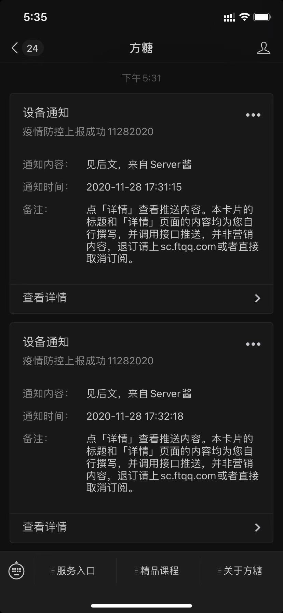

# bupt-ncov-report-action

自动填报北邮 COVID-19 疫情信息。



## 使用方法

```bash
node src/index.js -h

Usage: app [options]
Options:
-V, --version         output the version number  
-u, --user [value]    BUPT username
-p, --pass [value]    BUPT password
-s, --server [value]  ServerJ push key   
-h, --help            display help for command

# 执行上报
node src/index.js -s {serverJ_key} -u {user} -p {pass}
```
